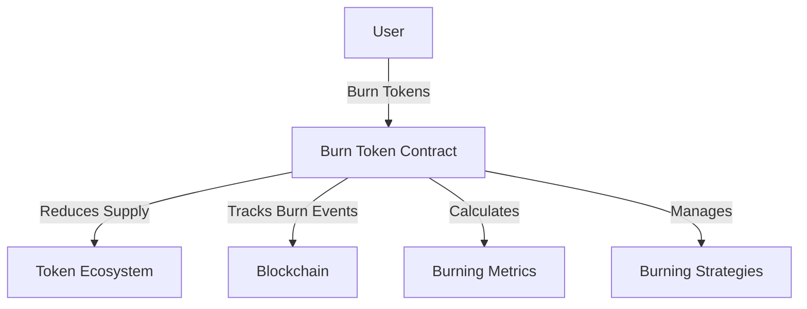

# Burn Craft: Token Burning Mechanism

A programmable token burning protocol built on the Stacks blockchain for dynamic token supply reduction and advanced burning strategies.

## Overview

Burn Craft provides a sophisticated blockchain-based solution for token burning with controlled, strategic supply reduction. The system enables advanced token economics through programmable burning mechanisms that support various burning strategies and incentive models.

### Key Features
- Dynamic token burning strategies
- Granular burning controls
- Transparent token supply tracking
- Programmable burning incentives
- Flexible burning mechanisms
- Economic supply management

### Use Cases
- Deflationary token models
- Token value appreciation strategies
- Tokenomics optimization
- Community-driven burning mechanisms
- Incentive-based token reduction

## Architecture

The system is built around a core smart contract that manages token burning, tracking, and economic strategies. Here's the core design:



### Core Components
- Token Burning Registry
- Burning Strategy Management
- Burn Tracking System
- Economic Impact Calculator
- Incentive Mechanism

## Contract Documentation

### burn-token.clar

The main contract handling token burning functionality.

#### Burning Levels
- STANDARD (0): Basic token burning
- DYNAMIC (1): Adaptive burning based on metrics
- COMMUNITY (2): Community-driven burning
- STRATEGIC (3): Advanced economic burning

#### Key Data Structures
- `burn-events`: Tracks individual burning events
- `burn-strategies`: Manages different burning mechanisms
- `total-burned`: Tracks cumulative tokens burned
- `burn-metrics`: Stores burning impact data

## Getting Started

### Prerequisites
- Clarinet
- Stacks wallet
- Token contract

### Installation
1. Clone the repository
2. Install dependencies
3. Deploy using Clarinet

```bash
clarinet deploy
```

### Basic Usage

1. Burn tokens:
```clarity
(contract-call? .burn-token burn-tokens
    u1000 
    "STANDARD")
```

2. Check total burned:
```clarity
(contract-call? .burn-token get-total-burned)
```

## Function Reference

### Burning Management
- `burn-tokens`: Execute token burning
- `set-burn-strategy`: Configure burning mechanism
- `get-total-burned`: Retrieve total burned tokens
- `get-burn-metrics`: Analyze burning impact

### Burning Strategies
- `standard-burn`: Basic token destruction
- `dynamic-burn`: Adaptive burning
- `community-burn`: Community-triggered burning
- `strategic-burn`: Advanced economic burning

## Development

### Testing
Run the test suite using Clarinet:
```bash
clarinet test
```

### Local Development
1. Start Clarinet console:
```bash
clarinet console
```

2. Interact with contract:
```clarity
(contract-call? .burn-token ...)
```

## Security Considerations

### Key Security Features
- Transparent burning mechanisms
- Immutable burning event tracking
- Controlled token supply reduction
- Flexible burning strategies
- Economic impact calculations

### Best Practices
1. Carefully design burning strategies
2. Monitor token economics
3. Implement gradual burning mechanisms
4. Ensure community transparency
5. Validate burning impact

### Limitations
- Gas costs for complex burning
- Block size constraints
- Economic prediction challenges
- Potential market volatility